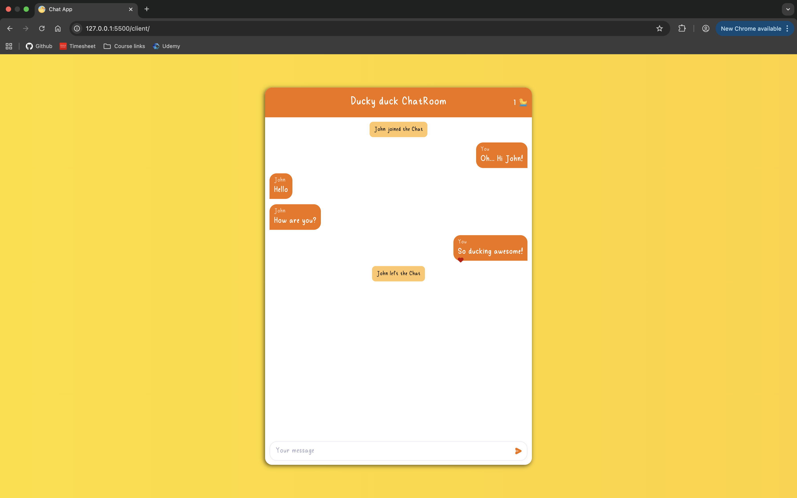

# Ducky Duck Chat Application

A simple real-time chat application built with Node.js, Express, and Socket.io for the backend, and vanilla JavaScript, HTML, and SCSS for the frontend.

## Features
- Real-time messaging between multiple users
- Responsive and modern chat UI
- User-friendly interface
- Custom SCSS styling


## Project Structures
```
client/
  client.js         # Frontend JavaScript
  index.html        # Main HTML file
  main.css          # Compiled CSS
  assets/           # Static assets (images, etc.)
  style/            # SCSS source files
    _chat.scss
    _message.scss
    _variables.scss
    styles.scss
server/
  index.js          # Backend server (Node.js + Express + Socket.io)
  package.json      # Server dependencies
```


## Getting Started


### Prerequisites
- [Node.js](https://nodejs.org/) (v14 or higher recommended)


### Installation
1. Clone the repository:
   ```bash
   git clone https://github.com/catalina-constantin/Chat-Application.git
   cd Chat-Application
   ```
2. Install server dependencies:
   ```bash
   cd server
   npm install
   ```
3. (Optional) Compile SCSS to CSS:
   - Use a tool like [Sass](https://sass-lang.com/install) to compile `style/styles.scss` to `main.css` in the `client` folder.


### Running the Application
1. Start the server:
   ```bash
   npm start
   ```
2. Open `client/index.html` in your browser.


## Usage
- Enter your name and start chatting in real time with other users connected to the server.

<div align="center">
  
</div>

## Technologies Used
- Node.js
- Express
- Socket.io
- HTML5, CSS3 (SCSS), JavaScript


## License
This project is for educational purposes.
